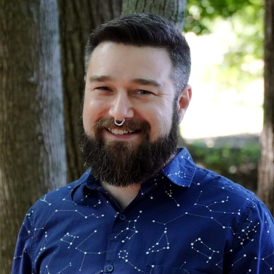

# Joshua Thomas

# About Me
I am currently an assistant professor at <a href="https://www.alfred.edu/">Alfred University</a> where I teach introductory calculus-based physics, introductory astronomy, and introductory astrophysics. I am also the director of Alfred's Stull Observatory.  My faculty page can be found <a href="https://www.alfred.edu/academics/faculty-staff/profiles/thomas-joshua-d.cfm">here</a>.

I defended my Ph.D. at the University of Toledo on May 29, 2012. I studied the post-AGB star at the heart of the Red Rectangle nebula. The next phase of my research on the Red Rectangle involves a radiative transfer model of the Red Rectangle nebula. My most active research at the moment has been setting up a Shelyak eShel II spectrograph Stull Observatory for observations of the next WR140 periastron passage. Current astrophysics projects involve binary stars, Be stars, and Wolf-Rayet stars. I have also conducted research in observational spectroscopy, laboratory astrophysics and atomic physics.  

Other research interests lie in using image analysis and python to solve problems.  This has resulted in fruitful collaborations studying dinosaur bones and eggs.

# Projects and Links

Curriculum Vitae

<a href="https://github.com/thomasjoshd/pysplot">PySplot</a>

<a href="https://github.com/thomasjoshd/Volume_SurfaceArea_Eggs">Volume/Surface Area of Eggs</a> (or other spheroidal objects)

<a href="http://www.youtube.com/user/JoshuaDThomas">YouTube</a>

Last Updated: 01-APR-2024
